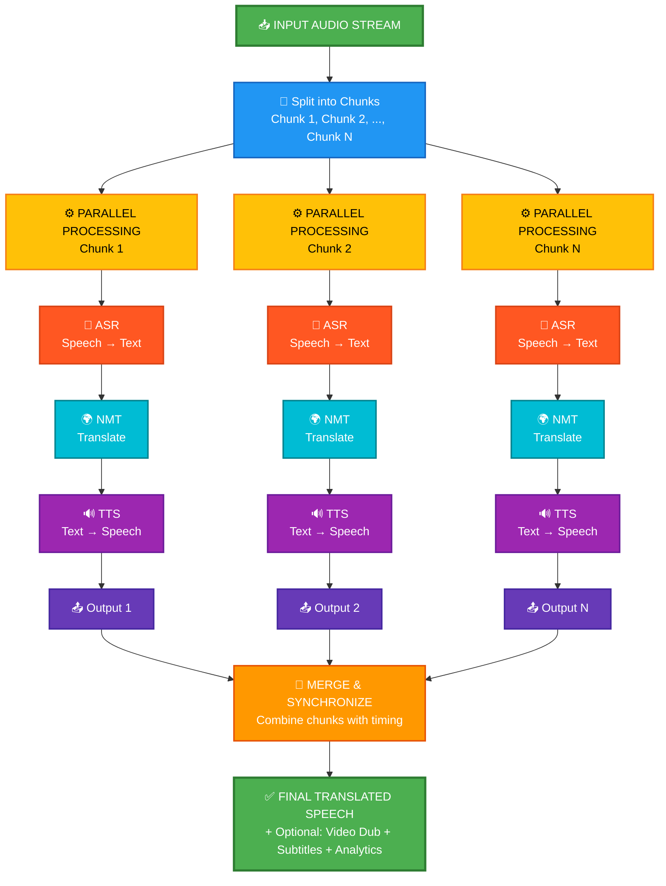

# 🎤 Ultra Audio Studio

### *AI-Powered Speech-to-Speech Translation Platform*

[](https://www.python.org/)
[](https://fastapi.tiangolo.com/)
[](https://streamlit.io/)
[](https://azure.microsoft.com/)
[](LICENSE)

---

## 📋 Table of Contents

1. [🌟 Project Introduction](#-project-introduction)
2. [🎥 Demo Video](#-demo-video)
3. [✨ Key Features](#-key-features)
4. [🛠️ Tech Stack](#-tech-stack)
5. [🏗️ System Architecture](#-system-architecture)
6. [🔄 Speech-to-Speech Pipeline](#-speech-to-speech-pipeline)
7. [📦 Installation & Setup](#-installation--setup)
8. [🚀 Quick Start](#-quick-start)
9. [📸 Screenshots](#-screenshots)

---

## 🌟 Project Introduction

**Ultra Audio Studio** is a cutting-edge **AI-powered Speech-to-Speech Translation Platform** that leverages Azure Cognitive Services, advanced machine learning, and real-time processing to break language barriers instantly.

## Demo Link
https://ultraaudiostudio.streamlit.app/

### 🎯 What We Do

Transform speech from one language to another **in real-time** without compromising on:
- 🗣️ Natural voice quality and emotion
- ⚡ Low latency (sub-second processing)
- 🌍 Multi-language support
- 🎚️ Voice customization and personalization

### 💡 Key Value Propositions

| Use Case | Benefit |
|----------|---------|
| 🔴 **Live Stream Translation** | Break language barriers for global audiences in real-time |
| 🎬 **Content Dubbing** | Auto-dub videos & podcasts in multiple languages instantly |
| 🎙️ **Voice Recording & Dubbing** | Create professional dubbed content from simple voice recordings |
| 👥 **Remote Meeting Translation** | Real-time translation for international team collaboration |
| 📊 **Live Analytics** | Monitor metrics, latency, and performance in real-time |

---

## 🎥 Demo Video

https://github.com/user-attachments/assets/13535ca0-0c07-4505-b8ac-f579900c5f2d

---

## ✨ Key Features

### 🎤 **Live Speech Translation**
- Real-time Speech → Text → Translation → Speech pipeline
- Ultra-low latency for seamless communication
- Continuous streaming support with chunked processing

### 🎬 **Media Auto-Dubbing**
- Upload video/audio files and auto-dub in target language
- Automatic speaker detection and voice cloning
- Batch processing for multiple files

### 🎙️ **Instant Voice Dubbing**
- Record audio directly and generate translated speech
- One-click translation workflow
- Instant playback preview

### 👥 **Remote Meeting Translation**
- Room-based real-time translation
- Multi-participant support
- Live transcription logs

### 📊 **Advanced Analytics & Monitoring**
- Real-time performance metrics
- Latency tracking and optimization
- Processing logs and error reporting
- Session history and statistics

### 🎚️ **Voice Customization**
- Emotion control (Neutral, Happy, Sad, Angry)
- Speed adjustment (0.5x - 2.0x)
- Pitch modification
- Multiple voice options per language

### 🌍 **Multi-Language Support**
- 50+ languages supported
- Neural Machine Translation (NMT)
- High-quality voice synthesis

### 📝 **SRT Subtitle Generation**
- Automatic subtitle file generation
- Timing synchronization
- Multi-language subtitle tracks

---
# 🌍 Real-World Scenarios

Discover real-world applications of Ultra Audio Studio across industries—from instant Global Corporate Earnings Call to Telemedicine Platform —each demonstrating production-grade implementation with measurable business impact.


---

## 📈 Scenario 1: Global Corporate Earnings Call

**Use Case**
A multinational company needs real-time translation of CEO speeches into **8 languages** during an annual earnings call.

**How It Works**
`orchestrator.py` manages concurrent translation pipelines. Speech is recognized once → translated into eight languages → synthesized into eight audio streams → all delivered with **under 1-second latency**. Live Q&A is handled with full bidirectional translation.

---

## 🎓 Scenario 2: University International Student Orientation

**Use Case**
A university delivers orientation content to students from **45 countries** in **10 languages**.

**How It Works**
The Dean’s video is uploaded to **Batch Studio**, where the system automatically segments scenes, analyzes tone, translates speech into 10 languages, generates **dubbed audio + lip-sync**, and produces multilingual subtitles. The output includes **10 fully localized video versions** ready for distribution.

---

## 🏨 Scenario 3: Luxury Hotel Guest Concierge Service

**Use Case**
A 5-star hotel offers multilingual concierge support for guests from **30 countries**.

**How It Works**
Guests speak in their native language → system recognizes and translates → concierge responds in English → response is translated back with a warm hospitality tone. Works for dining, travel planning, emergencies, and medical help.

---

## 🎬 Scenario 4: YouTube Creator – Global Content Expansion

**Use Case**
A YouTuber wants to publish videos in **15 languages** to reach a global audience.

**How It Works**
Creator uploads the video to **Batch Studio**. The system detects scenes, extracts and preserves emotional tone, translates into 15 languages, and generates **TTS + lip-sync** alongside multilingual subtitles. Outputs **15 fully dubbed** video versions.

---

## 🏥 Scenario 5: Telemedicine Platform – Global Healthcare

**Use Case**
A telemedicine provider connects doctors and patients across **20 countries** with different languages.

**How It Works**
The **Remote Meeting** tab enables real-time, bidirectional medical translation. Patient speech is translated to the doctor’s language and vice versa, using medically optimized vocabulary. Complete transcripts are generated for compliance and audit requirements.

---

## 🛠️ Tech Stack

### **Frontend**
| Technology | Purpose |
|------------|---------|
|  | Interactive web UI & dashboards |
|  | Core application logic |
|  | Real-time analytics visualization |

### **Backend APIs**
| Technology | Purpose |
|------------|---------|
|  | High-performance REST APIs |
|  | Live stream communication |
|  | Backend core logic |

### **AI & ML Services**
| Service | Role |
|---------|------|
|  | Automatic Speech Recognition (ASR) |
|  | Neural Machine Translation (NMT) |
|  | Neural Text-to-Speech (TTS) |

### **Data & Storage**
| Technology | Purpose |
|------------|---------|
|  | Session history and analytics |
|  | Configuration and data serialization |

### **Media Processing**
| Library | Purpose |
|---------|---------|
| MoviePy | Video/Audio manipulation |
| SoundFile | Audio file I/O |
| Noisereduce | Audio enhancement |
| FFmpeg | Media encoding/decoding |

### **Deployment & Compute**
| Platform | Purpose |
|----------|---------|
|  | Compute and services hosting |
|  | Application containerization |
|  | Source code management |

---

## 🏗️ System Architecture

### High-Level Overview

```
┌─────────────────────────────────────────────────────────────────┐
│                     Ultra Audio Studio                          │
├─────────────────────────────────────────────────────────────────┤
│                                                                 │
│  ┌──────────────────────────────────────────────────────────┐  │
│  │            FRONTEND (Streamlit Web UI)                  │  │
│  │  ┌─────────────┐  ┌──────────────┐  ┌──────────────┐    │  │
│  │  │Live Stream  │  │Record & Dub  │  │Batch Studio  │    │  │
│  │  └─────────────┘  └──────────────┘  └──────────────┘    │  │
│  │  ┌─────────────┐  ┌──────────────┐  ┌──────────────┐    │  │
│  │  │Remote Mtg   │  │Analytics     │  │History       │    │  │
│  │  └─────────────┘  └──────────────┘  └──────────────┘    │  │
│  └──────────────────────────────────────────────────────────┘  │
│                         │                                       │
│                         ▼                                       │
│  ┌──────────────────────────────────────────────────────────┐  │
│  │            BACKEND (FastAPI + WebSockets)               │  │
│  │  ┌─────────────────────────────────────────────────┐    │  │
│  │  │   Speech-to-Speech Pipeline Orchestrator        │    │  │
│  │  └─────────────────────────────────────────────────┘    │  │
│  └──────────────────────────────────────────────────────────┘  │
│                         │                                       │
│         ┌───────────────┼───────────────┐                       │
│         ▼               ▼               ▼                       │
│  ┌─────────────┐ ┌─────────────┐ ┌──────────────┐             │
│  │   ASR       │ │   NMT       │ │    TTS       │             │
│  │ (Speech→Txt)│ │ (Txt→Txt)   │ │ (Txt→Speech) │             │
│  │   Azure     │ │   Azure     │ │   Azure      │             │
│  └─────────────┘ └─────────────┘ └──────────────┘             │
│                                                                 │
│  ┌──────────────────────────────────────────────────────────┐  │
│  │     PROCESSING MODULES                                  │  │
│  │  ┌──────────────┐  ┌──────────────┐  ┌──────────────┐  │  │
│  │  │Scene Detect  │  │Speaker ID    │  │Emotion Ctrl  │  │  │
│  │  └──────────────┘  └──────────────┘  └──────────────┘  │  │
│  │  ┌──────────────┐  ┌──────────────┐  ┌──────────────┐  │  │
│  │  │Lip Sync Gen  │  │SRT Generator │  │Noise Reduce  │  │  │
│  │  └──────────────┘  └──────────────┘  └──────────────┘  │  │
│  └──────────────────────────────────────────────────────────┘  │
│                                                                 │
│  ┌──────────────────────────────────────────────────────────┐  │
│  │     DATA STORAGE & LOGGING                              │  │
│  │  ┌──────────────┐  ┌──────────────┐  ┌──────────────┐  │  │
│  │  │SQLite DB     │  │Session Logs  │  │Analytics    │  │  │
│  │  │(History)     │  │(Metrics)     │  │(Statistics) │  │  │
│  │  └──────────────┘  └──────────────┘  └──────────────┘  │  │
│  └──────────────────────────────────────────────────────────┘  │
│                                                                 │
└─────────────────────────────────────────────────────────────────┘
```

### Core Modules

| Module | Responsibility | File |
|--------|-----------------|------|
| 🎬 **Pipeline** | Orchestrates end-to-end speech translation | `ultraaudio/pipeline.py` |
| 🎙️ **Scene Detection** | Detects speaker changes and scene breaks | `ultraaudio/scene_detection.py` |
| 👤 **Speaker ID** | Identifies and tracks speakers | `ultraaudio/speaker_id.py` |
| 😊 **Emotion** | Controls emotional tone of output speech | `ultraaudio/emotion.py` |
| 👁️ **Lip Sync** | Generates lip-sync data for video dubbing | `ultraaudio/lipsync.py` |
| 📝 **SRT Utils** | Generates subtitle files | `ultraaudio/srt_utils.py` |
| ⚙️ **Config** | Centralized configuration management | `ultraaudio/config.py` |
| 🛠️ **Utils** | Helper functions and utilities | `ultraaudio/utils.py` |

---

## 🔄 Speech-to-Speech Pipeline

### Complete Data Flow

```mermaid
graph TD
    A["🎤 AUDIO INPUT<br/>(Live Stream / File Upload / Recording)"] --> B["1️⃣ AUDIO PREPROCESSING<br/>• Split into chunks 15-30 sec<br/>• Noise reduction & normalization<br/>• Format: WAV, PCM-16, 16kHz"]
    
    B --> C["2️⃣ AUTOMATIC SPEECH RECOGNITION<br/>• Azure Speech Services API<br/>• Source Language Detection<br/>• Transcribed Text Output<br/>• Confidence Scoring"]
    
    C --> D["3️⃣ NEURAL MACHINE TRANSLATION<br/>• Azure Translator API<br/>• Source → Target Language<br/>• Context-aware translation<br/>• Translated Text Output"]
    
    D --> E["4️⃣ VOICE CUSTOMIZATION<br/>• Emotion: Neutral/Happy/Sad/Angry<br/>• Speed: 0.5x - 2.0x<br/>• Pitch Modification<br/>• Voice Variant Selection"]
    
    E --> F["5️⃣ TEXT-TO-SPEECH SYNTHESIS<br/>• Azure Neural TTS<br/>• Natural Speech Generation<br/>• Audio: WAV/MP3<br/>• Timing Info for Sync"]
    
    F --> G["6️⃣ AUDIO POSTPROCESSING<br/>• Combine Audio Chunks<br/>• Volume Normalization<br/>• Quality Optimization<br/>• Format Encoding"]
    
    G --> H{Optional<br/>Video Dub?}
    H -->|Yes| I["7️⃣ VIDEO DUBBING + LIP-SYNC<br/>• Speaker Region Detection<br/>• Lip-sync Animation<br/>• Audio Overlay<br/>• Dubbed Video Output"]
    H -->|No| J{Optional<br/>Subtitles?}
    
    I --> J{Optional<br/>Subtitles?}
    J -->|Yes| K["8️⃣ SUBTITLE GENERATION<br/>• SRT File Generation<br/>• Timing Sync<br/>• Multi-language Tracks"]
    J -->|No| L["9️⃣ LOGGING & ANALYTICS<br/>• Processing Time per Step<br/>• API Latency Tracking<br/>• Session Metadata Storage<br/>• Performance Reports"]
    K --> L
    
    L --> M["🔊 FINAL OUTPUT<br/>Translated Speech + Optional Video/Subtitles"]
    
    style A fill:#4CAF50,stroke:#2E7D32,stroke-width:3px,color:#fff
    style B fill:#2196F3,stroke:#1565C0,stroke-width:2px,color:#fff
    style C fill:#2196F3,stroke:#1565C0,stroke-width:2px,color:#fff
    style D fill:#2196F3,stroke:#1565C0,stroke-width:2px,color:#fff
    style E fill:#FF9800,stroke:#E65100,stroke-width:2px,color:#fff
    style F fill:#2196F3,stroke:#1565C0,stroke-width:2px,color:#fff
    style G fill:#9C27B0,stroke:#6A1B9A,stroke-width:2px,color:#fff
    style H fill:#FFC107,stroke:#F57F17,stroke-width:2px,color:#000
    style I fill:#FF5722,stroke:#D84315,stroke-width:2px,color:#fff
    style J fill:#FFC107,stroke:#F57F17,stroke-width:2px,color:#000
    style K fill:#00BCD4,stroke:#00838F,stroke-width:2px,color:#fff
    style L fill:#673AB7,stroke:#4527A0,stroke-width:2px,color:#fff
    style M fill:#4CAF50,stroke:#2E7D32,stroke-width:3px,color:#fff
```



### Processing Architecture - Parallel Chunked Processing



---

## 📦 Installation & Setup

### Prerequisites

- **Python**: 3.9 or higher
- **Operating System**: Windows, macOS, or Linux
- **RAM**: Minimum 8GB (16GB recommended)
- **Storage**: 5GB free space for models and temporary files
- **Internet**: Required for Azure services

### Step 1: Clone the Repository

```powershell
git clone https://github.com/puspitaj300-code/Speech-to-speech-Project-.git
cd Speech-to-speech-Project-
```

### Step 2: Create a Python Virtual Environment

```powershell
# Create virtual environment
python -m venv venv

# Activate virtual environment
# On Windows:
venv\Scripts\Activate.ps1

# On macOS/Linux:
source venv/bin/activate
```

### Step 3: Install Dependencies

```powershell
# Install Python packages
pip install -r requirements.txt

# Install backend-specific dependencies
pip install -r scripts/backend/requirements.txt
```

### Step 4: Configure Azure Services

You need Azure Cognitive Services credentials for Speech, Translator, and Text-to-Speech APIs.

#### Option A: Environment Variables (Recommended)

Create a `.env` file in the project root:

```env
# Azure Speech Services
AZURE_SPEECH_KEY=your_speech_key_here
AZURE_SPEECH_REGION=eastus

# Azure Translator
AZURE_TRANSLATOR_KEY=your_translator_key_here
AZURE_TRANSLATOR_REGION=eastus

# Azure Text-to-Speech (usually same as Speech Services)
AZURE_TTS_KEY=your_tts_key_here
AZURE_TTS_REGION=eastus
```

#### Option B: Configuration File

Edit `scripts/backend/ultraaudio/config.py`:

```python
# Load from config.py
AZURE_SPEECH_KEY = "your_key"
AZURE_SPEECH_REGION = "eastus"
AZURE_TRANSLATOR_KEY = "your_key"
# ... etc
```

#### Getting Azure Keys

1. Go to [Azure Portal](https://portal.azure.com)
2. Create or select a **Cognitive Services** resource
3. Copy your **API Key** and **Region**
4. Add to `.env` or `config.py`

### Step 5: Install System Dependencies (Optional but Recommended)

```powershell
# Install FFmpeg (required for video processing)
# On Windows (using Chocolatey):
choco install ffmpeg

# On macOS (using Homebrew):
brew install ffmpeg

# On Linux (Ubuntu/Debian):
sudo apt-get install ffmpeg
```

### Step 6: Verify Installation

```powershell
python -c "import streamlit; import fastapi; print('✅ Installation successful!')"
```

---

## 🚀 Quick Start

### Start the Application

```powershell
# Navigate to the project directory
cd Speech-to-speech-Project-

# Run the main application
python scripts/backend/app.py
```

The Streamlit app will launch at: **http://localhost:8501**

### First Time Setup Checklist

- [ ] Azure keys configured in `.env` or `config.py`
- [ ] Virtual environment activated
- [ ] All dependencies installed (`pip install -r requirements.txt`)
- [ ] FFmpeg installed (for video/audio processing)
- [ ] Internet connection available

### Running Tests

```powershell
# Run pipeline debug tests
python scripts/backend/test_pipeline_debug.py

# Run backend tests
pytest scripts/backend/ -v

# Run with coverage
pytest scripts/backend/ --cov=scripts.backend --cov-report=html
```

---
## 📸 Screenshots
### Video Dub


### Dashboard Overview


### Record & Dub Interface


### Live Stream


### History


### Analytics Dashboard


### Batch Studio Player


---

---
## ⭐ Star Us!

If you find this project helpful, please consider giving it a ⭐ on [GitHub](https://github.com/puspitaj300-code/Speech-to-speech-Project-)!

---

<div align="center">

**Made with ❤️ by puspitaj300-code**

*Breaking Language Barriers Through AI* 🌍🎤

**Happy Translating! 🗣️✨**

</div>
